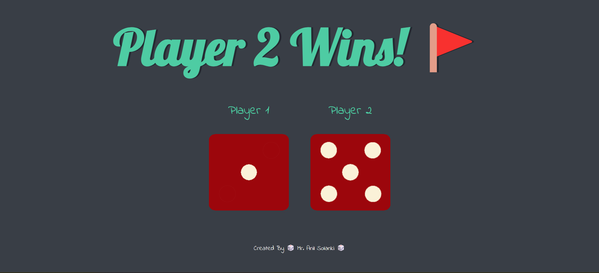

# 🎲 Dice Game  

## 📌 Overview  
This is a simple **Dice Game** built with HTML, CSS, and JavaScript. It simulates a dice roll between **two players**, and on every page load, the game determines the winner by comparing the two dice rolls.  

## 🌐 Live Demo  
🔗 **Play the Game Here:** [Click to Play](https://anilsol159.github.io/Dicee-in-html-css-js/)  

## 🖼 Screenshot  
  

## 🚀 Features  
- **Random Dice Roll** for Player 1 and Player 2 on every page load  
- **Displays Dice Images** corresponding to the random number generated (1-6)  
- **Determines the Winner** and displays the result  
- **Simple and Responsive UI** using HTML and CSS  

## 🛠 Installation  

1. Clone this repository:  
   ```bash
   git clone <repo-url>
   cd <repo-folder>
